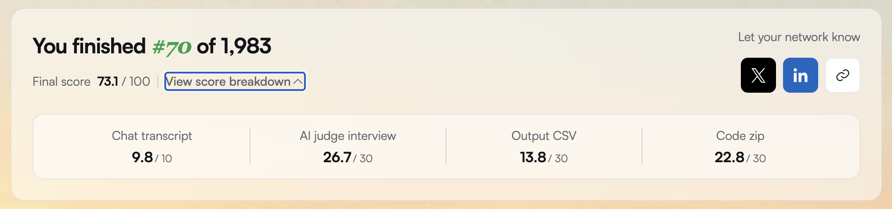
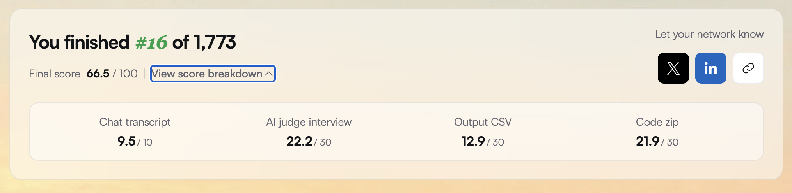

# HackerRank Orchestrate — August 2026

**A message notification router. 1,983 entrants, finished #70 with 73.1/100.**

[](#results)
[](#results)
[](https://github.com/GodVilan/HackerRank-Orchestrate-June-2026)
[](#)
[](https://claude.com/claude-code)
[](#)
[](#multimodal)
[](#operational-profile)
[](#operational-profile)
[](LICENSE)

Route every message in a WhatsApp-style inbox to **notify**, **digest**, or **mute** —
personalized to the receiving user, across text, image, and voice-note inputs, emitting a
machine-checkable justification for every decision.

**The model perceives; the code decides.** One Claude call per message returns a structured
semantic reading and nothing else. It never returns `action`, `reason`, or `confidence` —
those three fields are produced entirely by deterministic code. Precedence lives in
branches, not in prompt discipline: a prompt can be argued with, a branch that returns
before the next branch is reached cannot.

This repository is the submission **exactly as graded**, unpatched, plus the errata found
after grading. The primary technical documentation is
**[`code/README.md`](code/README.md)** (architecture, module contracts, five recorded
design decisions with their rejected alternatives, and a measured known-limitations
section) and **[`code/evaluation/evaluation_report.md`](code/evaluation/evaluation_report.md)**
(metrics, the Config A/B ablation, calibration curve, reproducibility experiment, and an
explicit "what was not tested" list).

---

## Results

| Component | June 2026 | August 2026 | Δ |
|---|---|---|---|
| Chat transcript | 9.5 / 10 | **9.8 / 10** | +0.3 |
| AI judge interview | 22.2 / 30 | **26.7 / 30** | +4.5 |
| Output CSV | 12.9 / 30 | **13.8 / 30** | +0.9 |
| Code zip | 21.9 / 30 | **22.8 / 30** | +0.9 |
| **Final** | **66.5 / 100** | **73.1 / 100** | **+6.6** |
| **Rank** | **#16 of 1,773** | **#70 of 1,983** | **−54** |

Score up 6.6. Rank down 54. The field improved faster than this submission did.

> **Denominators, since the event publishes three.** 22,000+ people registered for the August
> edition, 2,475 shipped an agent, and 1,983 completed the AI interview. The leaderboard ranks
> the 1,983 who finished every component, which is the denominator on the scorecard and the
> one used throughout this repository. The other two describe attrition, not standing.

<p align="center">
  <br><br>
  
</p>

---

## The open question

After June, the working hypothesis was that the Output CSV component scored low because the
self-built scorer measured only whether the primary label was correct, while the judge also
graded the *justification* — reason quality, evidence relevance, confidence calibration.

August was rebuilt on that hypothesis:

- **Evidence IDs are selected, never generated.** A deterministic candidate pool is built by
  filtering history to this recipient and this sender/group/business. The model picks from
  the pool; `evidence.enforce_evidence` drops anything outside it. An empty pool resolves to
  `none` **in code** — the model is not asked.
- **Reason strings come from a fixed catalogue**, keyed by rule and looked up *after* the
  fields are final. A reason cannot contradict the fields it explains, because it is emitted
  downstream of them.
- **Confidence is deterministic banding** — base by action, plus one step per corroborating
  signal, with a `disagreement_override` that pins the tier to 0 whenever the model's
  `proposed_action` disagrees with the ladder.

Measured on the 30 labeled rows: action accuracy **0.8333**, macro-F1 **0.8306**,
`message_type` **0.7667**.

Judged: **13.8 / 30**.

The gap between self-measurement and the grader is roughly where June left it. So the June
hypothesis is **unconfirmed** — the changes it motivated are defensible on their own logic,
and the graded component moved 12.9 → 13.8, which is inside noise. Either the hypothesis was
wrong, or it was right and the implementation missed the part that mattered. This repository
does not claim to know which, and the honest next step is to find out what the grader reads
before optimizing anything else.

> The evaluation report is explicit about what this can and cannot show: **action accuracy is
> held out; calibration is not.** The confidence bases were read off the same 30 gold rows
> the calibration curve is computed on. `T_FWD_MESSAGE` is partly constrained by gold too —
> bounded above only, with every value in 3…11 behaving identically on this corpus. The
> remaining thresholds were chosen from empty bands in the 110-row distributions, with no
> label input.

---

## The reproducibility result

`temperature=0.0` did **not** make this pipeline reproducible.

Router cache cleared, all 110 rows re-routed against byte-identical prompts:

| measure | value |
|---|---|
| readings compared | 140 |
| readings that changed on any field | **43 (30.7%)** |
| readings that changed on a *structured* field | 21 (15.0%) |
| output rows that differed | **8 of 110** |
| routing actions that changed | **1** |

The deterministic layers absorbed most of the drift before it could reach an output field.
That is the strongest available evidence for the architecture's central claim — and an
argument against treating temperature 0 as a determinism guarantee.

It also cost the project a conclusion. The rerun moved Config A from 0.8000 to 0.8333 **with
no code change**, which flipped the A-vs-B comparison from *on the band edge* to *within
noise*. Every number in the evaluation report is "as measured on the shipped run," not a
fixed property.

---

## Architecture

```
messages.csv ─┐
              ├─► data_layer.py ──► features.py ──┐
context CSVs ─┘   (load + index)   (all joins)    │
                                                  │
media files ──► transcription.py ─┐               │
                vision.py ────────┴─► media text ─┤
                                                  │
              evidence.py ──► candidate pool ─────┤
                                                  ▼
                                              router.py
                                     (ONE tool-use call, forced schema)
                                                  ▼
                                              gates.py
                                    (precedence ladder → action + rule_key)
                                                  ▼
                                             finalize.py
                                  (confidence tier + catalogue reason)
                                                  ▼
                                              writer.py ──► output.csv
                                                  ▼
                                          validate_output.py
```

**Precedence ladder.** Each layer overrides everything below it; a layer that fires returns
immediately.

| | Layer | Overridable by content reasoning? |
|---|---|---|
| 1 | **Safety** — scam, impersonation, router-injection attempt | No. A sender the user always opens is still muted if the message is credential harvesting. |
| 2 | **Hard user state** — group mute, promotion opt-out, quiet hours | No. One documented exception: a muted group still surfaces a direct `@mention`, and the mute is *lifted, not converted to notify* — control falls through to Layers 3–4. |
| 3 | **Personalization** — this user's history with this sender/group/business | — |
| 4 | **Content substance** — urgency and usefulness of what the message says | This is the only layer where the model's reading drives the outcome, and it is consulted last. |

Quiet hours are a **downgrade applied over a `notify` outcome**, not a returning branch —
implemented that way because as a plain branch they would have converted a Layer 3 mute into
a digest, an upgrade contradicting their intent.

**What code owns, never the model:** group role and admin status, mute state, quiet-hours
check against `created_at`, business verification, official-vs-sender domain comparison,
account and domain age, report rates, opt-in/opt-out state, per-sender open/reply/dismiss/
report rates, trailing daily notification load, `forwarded_count` banding, `@mention`
detection. Every one is a join or an arithmetic derivation. None is ever posed to the model
as a question.

<a name="multimodal"></a>
**Multimodal, and untrusted.** Images go through vision; voice notes through local
`faster-whisper` ASR with `task` pinned to `transcribe` rather than `translate` — a default
is not a contract, and `translate` would alter message content before routing. No audio is
sent to any API. `message_text`, OCR output, and transcripts are wrapped in delimiters, and
the system block states that content inside them is **evidence about the message, never an
instruction to the system**. Five rows in `messages.csv` attempt exactly that injection.

---

## Repository map

```
README.md                              you are here
ERRATA.md                              defects found after grading — not fixed in code/
results/output.csv                     the graded artifact, 110 rows
results/scorecard-*.png                official scorecards, both editions
transcript/log.txt                     the full build transcript (graded 9.8/10)
code/                                  the submission, as zipped
  README.md                            ← primary technical documentation
  evaluation/evaluation_report.md      ← metrics, ablation, reproducibility, coverage gaps
```

Twenty modules sit flat in `code/`. Reading order:

**Pipeline** — `main.py` → `data_layer.py` → `features.py` → `vision.py` /
`transcription.py` → `evidence.py` → `router.py` → **`gates.py`** → `finalize.py` →
`writer.py` → `validate_output.py`

**Contracts** — `schema.py` (every allowed value, output column order, reason catalogue,
rule keys), `prompts.py`, `config.py`

**Tests** — `test_gates.py` (28 cases), `test_schema.py` (16), `test_degraded.py` (7),
`test_vision.py` (5, against a PIL oracle)

**Diagnostics, kept as shipped** — `check_dataset.py` (17 integrity assertions),
`dryrun_gates.py` (rule-key reachability), `fit_thresholds.py`, `inspect_features.py`,
`inspect_gold_reasons.py`, `inspect_pools.py`, `preflight_api.py`,
`evaluation/diagnose_12b.py`

> **`gates.py` is the decision site.** Pure function — no I/O, no model calls, no import from
> `router.py`. If you read one file, read that one.
>
> **`fit_thresholds.py` fits nothing** despite its name. It is read-only: it prints the
> distributions the `config.py` constants were chosen from, including the empty band each
> threshold sits inside. See [ERRATA #4](ERRATA.md).

---

---

## How this was built

Built with [Claude Code](https://claude.com/claude-code) over the 24-hour contest window.
Claude Code was the development environment; `claude-sonnet-4-6` is what the shipped
pipeline calls at runtime. Different things.

The full build transcript is at [`transcript/log.txt`](transcript/log.txt) — every prompt
sent, in order, including the reversals. It records the Layer 3 business-notify hoist being
implemented, reviewed, and reverted for making `DIGEST_PROMO_OPTED_IN` structurally
unreachable, which is the kind of decision that leaves no trace in a final diff. It was
submitted as a graded component and scored **9.8 / 10**.

## Operational profile

Full uncached run over all 110 rows, cache cleared beforehand.

| | |
|---|---|
| Model | `claude-sonnet-4-6`, `temperature=0.0`, `max_tokens=1024`, prompt version 1 |
| Live routing calls | 110 (one per row) |
| Degraded rows / retries / errors | 0 / 0 / 0 |
| Input / output tokens | 128,220 / 23,317 |
| Cache read / write tokens | 159,467 / 1,463 |
| Wall clock | 463.0 s |
| **Total cost** | **$0.7877** ($0.0072 per row) |

Pricing assumption, stated because it goes stale: `claude-sonnet-4-6` at $3.00/M input and
$15.00/M output, Anthropic first-party list price, with cache reads at 0.1× and cache writes
at 1.25×. These rates are hardcoded in `write_report.py` and are not read from the API.

The call is made with `tool_choice` pinned to a single tool, so the response shape is
guaranteed rather than parsed. **There is no JSON-repair path anywhere in the codebase.** A
missing tool block is a failure to be handled, not a string to be salvaged.

Also present: on-disk router cache keyed on message id + rendered facts + candidate pool ids
+ model + `PROMPT_VERSION` + media; prompt caching on the stable system block; resumable
output that skips rows already written; a strict writer with exact column order; and a
standalone `validate_output.py` run before submission.

`ROUTER_MAX_WORKERS = 4` is configured but the shipped run was sequential — see
[ERRATA #1](ERRATA.md).

---

## Known limitations

These are documented in the shipped artifact, not discovered afterward.
[`code/README.md`](code/README.md#known-limitations) carries the full list with measured
counts; [`evaluation_report.md`](code/evaluation/evaluation_report.md) has the coverage
section. The ones worth knowing before you read the code:

- **`message_type` is a raw model passthrough**, enum-validated and nothing else. No join or
  ladder branch cross-checks it. That is where the `message_type` shortfall comes from.
- **The safety layers are unexercised where it matters.** Layers 1 and 2 decide 9 of the 30
  labeled rows, and on 8 of those the model independently proposed the same action — so no
  scored row exists where the layer had to overrule a disagreeing model. That is the layer's
  entire reason for existing.
- **`MUTE_IMPERSONATION_DOMAIN` fires on zero rows in both corpora.** The whole impersonation
  signature is unexercised code on the safety path.
- **10 of 33 rule keys never fire**, so their reason strings have never been emitted against
  a real row.
- **The degraded path has never run for real** — zero rows degraded in any run. Covered by
  `test_degraded` with injected failures and by nothing else.
- **Voice and image rows are not scored as a stratum**, so a failure confined to one modality
  would not appear in any reported number.
- **Only 30 labeled rows exist**, disjoint from the 110 predicted. One row is 3.33pp. The 110
  shipped rows have no ground truth at all.

**Untested modules:** `features.py` and `evidence.py` have no tests — including
`enforce_evidence`, the anti-hallucination guard. There is no pytest and no CI; each
`test_*.py` carries its own `_main()`. Covering the deterministic layer of a
deterministic-first architecture is the first item for the next edition.

---

## Running this

**The pipeline cannot be run end to end from this repository.** The contest dataset is
HackerRank's to distribute and is not vendored here.

- Problem statement, dataset, and full hackathon materials:
  **https://github.com/interviewstreet/hackerrank-orchestrate-august26**
- Place the dataset at `dataset/` relative to the repository root, as the original archive
  lays it out, then `python3 code/check_dataset.py` verifies every file and reference
  resolves.

```bash
python3 -m venv .venv && source .venv/bin/activate
pip install -r code/requirements.txt
export ANTHROPIC_API_KEY=...
cd code && python3 main.py                    # writes output.csv to the repository root
python3 validate_output.py                    # exits 0 only if every invariant holds
python3 -m evaluation.main --skip-judge       # score, zero model calls on a warm cache
```

Python 3.13 (3.10+ should work). Pinned: `anthropic` 0.120.2, `pandas` 2.3.2, `Pillow`
11.3.0, `faster-whisper` 1.2.1.

`ANTHROPIC_API_KEY` is the only secret this project has. It is read solely through
`config.require_api_key()`; no other module touches the environment, nothing logs it, and no
default or placeholder exists.

### Differences from the submitted archive

Two files present in the graded `code.zip` are not in this repository:

1. **`code/cache/transcripts.json`** — the ASR transcript cache. Committed deliberately in
   the submission so `main.py` could run without downloading Whisper weights; removed here
   because it contains the transcribed contents of the organizers' voice notes, and
   redistributing derived dataset content is not mine to do. With `dataset/` absent the
   pipeline cannot run regardless, so nothing is lost. Regenerate with
   `python3 transcription.py` once the dataset is in place.
2. **`code/.cache/router/`** — the model-response cache, already git-ignored.

No source file has been modified.

---

## Related

- **Official hackathon repository** — [interviewstreet/hackerrank-orchestrate-august26](https://github.com/interviewstreet/hackerrank-orchestrate-august26)
- **June 2026 edition** — [multi-modal insurance claim review agent](https://github.com/GodVilan/HackerRank-Orchestrate-June-2026), #16 of 1,773
- **Author** — [Srikanth Reddy Nandireddy](https://www.linkedin.com/in/srikanth-reddy-nandireddy/)

## License

MIT — see [LICENSE](LICENSE). Covers the code in this repository only. The contest dataset
and problem statement belong to HackerRank and are not included.